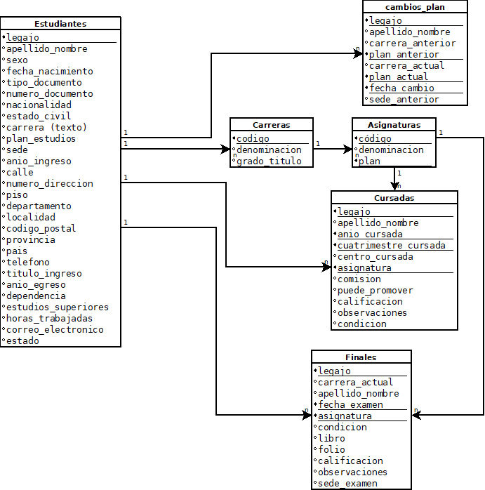
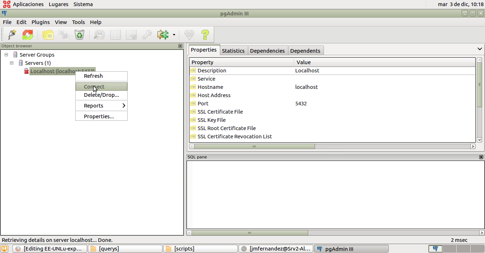
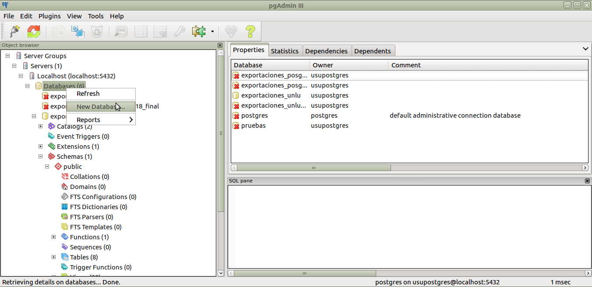
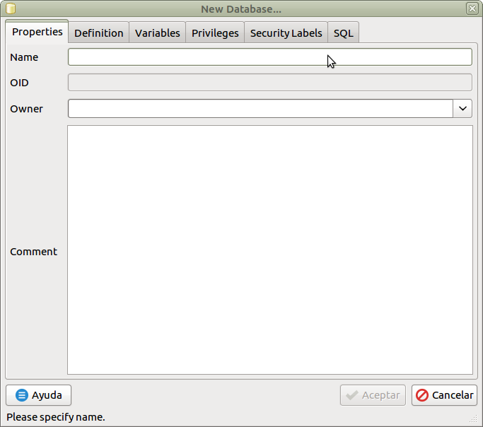
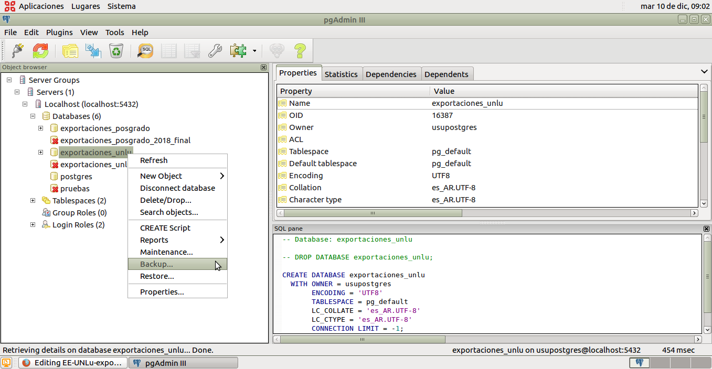
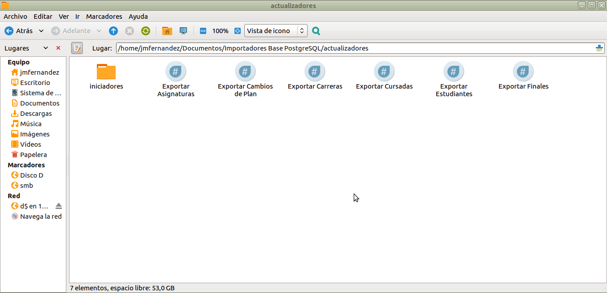
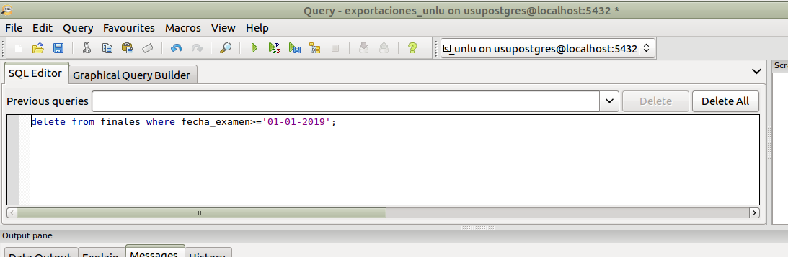
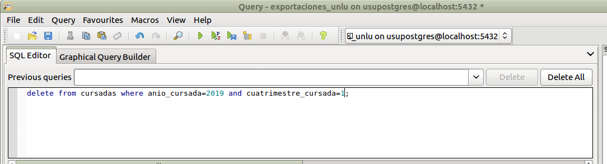

# Instructivo: exportación de datos a la DB SQL-UNLu

El objetivo de este instructivo es explicar los pasos a seguir para exportar los registros relacionados a la actividad académica de la Universidad a una base de datos relacional, compatible con PostgreSQL 9.5, para la ejecución de consultas complejas para la generación de información para la toma de decisiones.

## 1. Conceptos iniciales

### 1.1. Modelo de datos

A continuación se presenta el modelo de datos de la Base de Datos SQL:

### 1.2. Herramientas de software

Para la exportación de los datos, la gestión de la información y la persistencia se utilizarán las siguientes herramientas:

- PHP 7.0,
- PostgreSQL 9.5,
- PgAdmin 3.

## 2. Ejecución del proceso

### 2.1. Creación de la Base de Datos

Se asume que la base de datos ya existe y posee el nombre __exportaciones_unlu__, no obstante si se deseara generar una base de datos habría que seguir los siguientes pasos:

1. Abrir PgAdmin 3 y hacer doble click sobre el Servidor (en nuestro caso __Localhost__) o presionar click derecho y seleccionar _Connect_.

2. Se presiona el click derecho en el ícono _Databases_, dependiente del Servidor, y se selecciona _New Database..._.

3. Aquí se define el nombre en la etiqueta _Name_ y en la pestaña _Definition_ nos aseguramos que el encoding sea _UTF-8_.

Si pudimos seguir estos pasos, ya tenemos una base de datos creada y nos podemos conectar a la misma haciendo doble click.

### 2.2. Actualización de la Base de Datos desde Backup

Es una buena práctica de preservación de los datos ir generando backups periodicamente para evitar perdidas de información y al mismo tiempo conservar diferentes estados de la Base de Datos para reconstruir series de Anuarios Estadísticos publicados.
A continuación, se explica paso a paso como generarlos y como restaurar esos Backups.

#### 2.2.1. Crear Backup desde la Base de Datos

Para generar un backup con los datos de la Base de datos desde PgAdmin, debe conectarse al Servidor y haciendo click derecho presionamos sobre _Backup_.

#### 2.2.2. Restaurar Backup de la Base de Datos

Para restaurar el Backup, previamente debemos crear la Base de Datos de acuerdo a los pasos explicados en _2.1. Creación de la Base de Datos_. Una vez creada la Base de Datos, desde PgAdmin, debe conectarse al Servidor y haciendo click derecho sobre la Base creada elegimos la opción _Restore_. Seleccionamos el archivo creado mediante los pasos de _2.2.1 Crear Backup desde la Base de Datos_ y presionamos el botón _Restore_.

### 2.3. Actualización de la Base de Datos desde Exportaciones del Módulo Externo

La Base de Datos se alimenta de exportaciones del Módulo Administrador, las cuales consisten en archivos de texto separados por ";". Para la actualización de la Base de Datos, existen un conjunto de programas que incorporan esos datos, los cuales se encuentran en la ubicación __".../Documentos/Importadores Base PostgreSQL/scripts"__ de la PC. Los programas en cuestión son los siguientes:
- exportar_estudiantes.php (Actualiza Tabla estudiantes),
- exportar_cursadas.php (Actualiza Tabla cursadas),
- exportar_finales.php (Actualiza Tabla finales),
- exportar_carreras.php (Actualiza Tabla carreras),
- exportar_asignaturas.php (Actualiza Tabla asignaturas),
- exportar_cambios_plan.php (Actualiza Tabla cambios_plan).

A continuación de explica el proceso de generación de los archivos de texto y exportación de los mismos a la Base de Datos.

#### 2.3.1. Generación de archivos de texto a través del Menú Externo

Como se planteó antes, la Base de Datos se alimenta con archivos de texto, los cuales son generados en su totalidad desde el Menú Externo.

##### 2.3.1.1. Exportación Estudiantes

Para la generación de esta exportación, debe ingresarse al Menú Externo y acceder a las opción _"1-11-1 Estudiantes"_ con los siguientes parámetros de ingreso:
- Imprime datos privados: Si (Presione +).
- Opción de exportación: _1 A partir de un Legajo_.
- Desde: 0 (para asegurarnos que captamos todos los estudiantes).
- Hasta: 500.000 (para asegurarnos que captamos todos los estudiantes).
- Libres/Regulares/Todos (L/R/T): T (todos).
- Exluye Inhabilitados (+ Si / - No): - (No).
- Nombre del archivo: Ponemos un nombre cualquiera que lo identifique.

##### 2.3.1.2. Exportación Cursadas

Para la generación de esta exportación, debe ingresarse al Menú Externo y acceder a las opción _"1-11-2 Cursadas"_ con los siguientes parámetros de ingreso:
- Opción de exportación: _2 Por año y cuatrimestre_.
- Año: Se ingresa el año que se desea.
- Cuatrimestre: Se ingresa el cuatrimestre que se desea.
- Legajo desde: 1 (para asegurarnos que captamos todos los estudiantes).
- Hasta: 500.000 (para asegurarnos que captamos todos los estudiantes).
- Libres/Regulares/Todos (L/R/T): T (todos).
- Con o sin simultaneidad(C/S): S (Sin).
- Nombre del archivo: Ponemos un nombre cualquiera que lo identifique.

##### 2.3.1.3. Exportación Finales

Para la generación de esta exportación, debe ingresarse al Menú Externo y acceder a las opción _"1-11-3 Finales"_ con los siguientes parámetros de ingreso:
- Opción de exportación: _2 Por año de Final_.
- Desde: 0 (para asegurarnos que captamos todos los estudiantes).
- Hasta: 500.000 (para asegurarnos que captamos todos los estudiantes).
- Año: Se ingresa el año que se desea.
- Libres/Regulares/Todos (L/R/T): T (todos).
- Con o sin simultaneidad(C/S): S (Sin).
- Nombre del archivo: Ponemos un nombre cualquiera que lo identifique.

##### 2.3.1.4. Exportación Carreras

Para la generación de esta exportación, debe ingresarse al Menú Externo y acceder a las opción _"1-3-3 Listado de Carreras"_ con los siguientes parámetros de ingreso:
- Impresora, Pantalla o Archivo (I/P/A): A (Archivo).
Esta opción genera automáticamente en el Disco D: la exportación __Carreras.txt__.

##### 2.3.1.5. Exportación Asignaturas

Para la generación de esta exportación, debe ingresarse al Menú Externo y acceder a las opción _"1-3-1 Listado de Materias"_ con los siguientes parámetros de ingreso:
- Opción de exportación: _1 Listado por código de materia_.
- Impresora, Pantalla o Archivo (I/P/A): A (Archivo).
Esta opción genera automáticamente en el Disco D: la exportación __matxplan.txt__.

##### 2.3.1.6. Exportación Cambios de Plan

Para la generación de esta exportación, debe ingresarse al Menú Externo y acceder a las opción _"1-11-4 Cambios de Carrera/Plan".
Esta opción genera automáticamente en el Disco D: la exportación __CAMBCARR.TXT__.

#### 2.3.2. Incorporación de datos de las exportaciones desde los Scripts

Para la incorporación de los datos a partir de las exportaciones, primero deberán persistirse las exportaciones realizadas y descriptas en 2.3.1. en la carpeta __/exportaciones__ de la PC. Las exportaciones deberán renombrase en función de los siguientes criterios:
- Las exportaciones con los datos a incorporar en las tablas cambios_plan, asignaturas y carreras deberán mantener los nombres con los cuales los genera el Menú Externo (__CAMBCARR.TXT__, __matxplan.txt__ y __Carreras.txt__ respectivamente).
- La exportación con los datos de los estudiantes deberá ser renombrado como __EXP-ESTUDIANTES.TXT__.
- Las exportaciones con las cursadas de los estudiantes deberán renombrarse como __EXP-CURSADAS-AAAA-C__ donde AAAA es el año de las cursadas, representado mediante cuatro cifras, y C es el cuatrimestre, que puede tener los valores 1 ó 2.
- Por último, las exportaciones con los exámenes deberán renombrarse como __EXP-FINALES-AAAA__ donde AAAA es el año de las cursadas, representado mediante cuatro cifras.

Es importante tener en cuenta que podrán exportarse varias exportaciones tanto de exámenes como de cursadas al mismo tiempo, simplemente dejando las diferentes exportaciones en la carpeta previamente mencionada. Cuando esto suceda, el programa importador detectará automáticamente que existe mas de una e incorporará los datos al Sistema.

Una vez que las exportaciones fueron guardadas en la  carpeta __/exportaciones__ deberán ejecutarse los importadores, haciendo doble click en los íconos correspondientes a la tabla que se desee actualizar. Estos importadores se encuentran en la carpeta __/actualizadores__:

#### 2.3.3. Criterios de actualización de las Tablas de la Base de Datos

Los programas que actualizan la Base de Datos tienen los siguientes criterios de actualización:
- "Actualizar Asignaturas", "Actualizar Cambios de Plan", "Actualizar Carreras" y "Actualizar Estudiantes" __borrarán todos los datos presentes en la Tabla y volverán a cargarlos__ cada vez que se ejecuten los procesos.
- "Actualizar Cursadas" y "Actualizar Finales" __agregarán los nuevos datos junto con los pre-existentes__ en las Tablas Cursadas y Exámenes respectivamente.

Es importante hacer notar que debido al criterio de actualización de las Tablas Cursadas y Exámenes, si quisieran volver a incorporarse datos de cuatrimestre ya presentes en la Base de Datos, deberán borrarse previamente estas instancias desde PgAdmin con sentencias SQL.

Para la Tabla de Finales la sentencia deberá ser como la siguiente:

Mientras que para la Tabla de Cursadas, la sentencia deberá ser como la presentada a continuación:

Es importante ser __cuidadoso__ con las sentencias SQL anteriores puesto que si las condiciones definidas no son correctas podrían borrarse datos involuntariamente.

Por último, se sugiere persistir en la carpeta __/exportaciones/anteriores/__ las exportaciones utilizadas en cada actualización. Esta práctica permite tener los datos exportados en formato de texto plano a efectos de constatar la consistencia de la Base de Datos.

Si todo salió bien, finalizados estos pasos la Base de Datos estará operativa y actualizada a efectos de poder realizar consultas. Buen trabajo!

